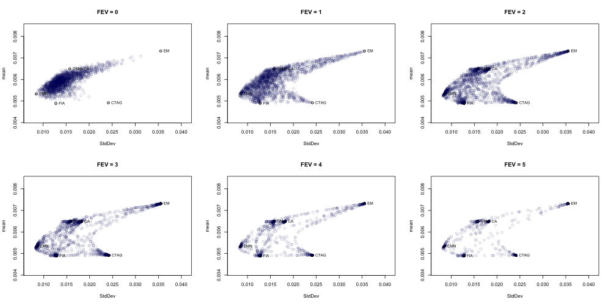
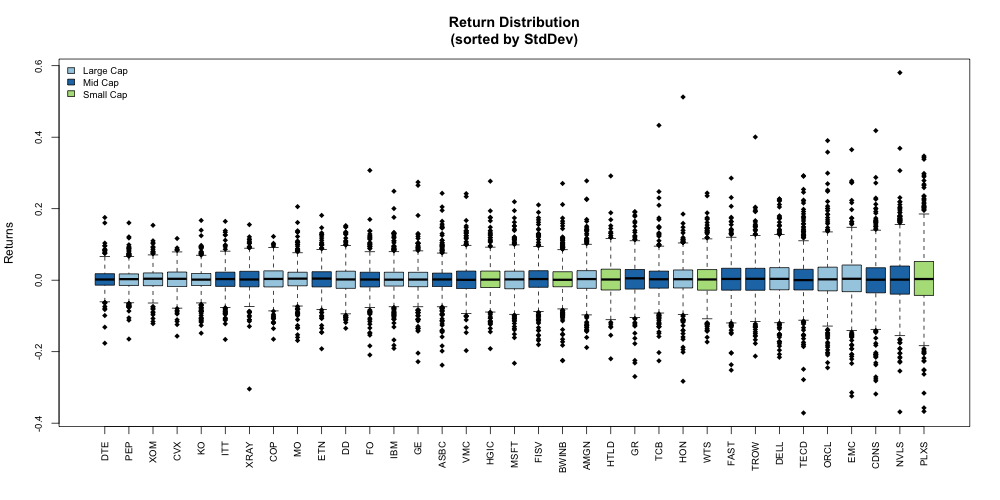
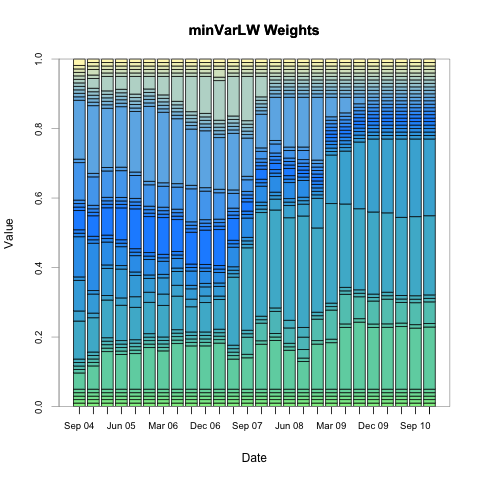
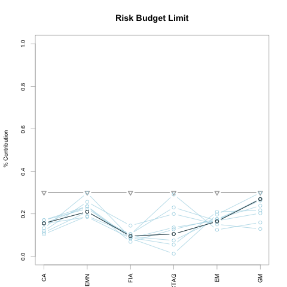
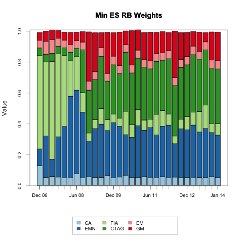
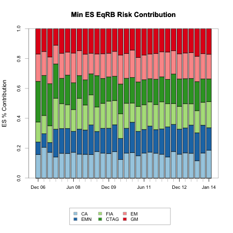
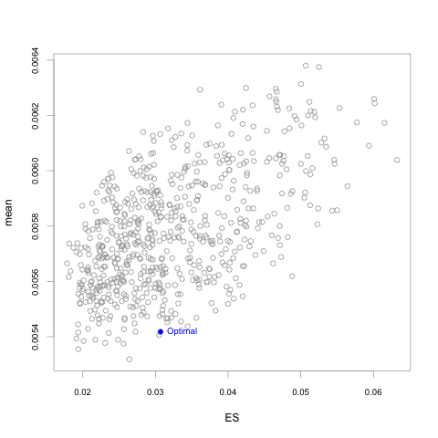
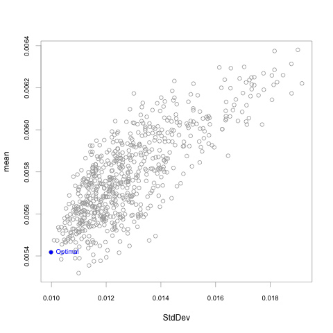

## Overview
* Discuss Portfolio Optimization
* Introduce PortfolioAnalytics
* Demonstrate PortfolioAnalytics with Examples

<!---
Discuss Portfolio Optimization
- Some background and theory of portfolio theory
- challenges
Introduce PortfolioAnalytics
- What PortfolioAnalytics does and the problems it solves
Demonstrate PortfolioAnalytics with Examples
- Brief overview of the examples I will be giving
-->

---

## Modern Portfolio Theory
"Modern" Portfolio Theory (MPT) was introduced by Harry Markowitz in 1952.

In general, MPT states that an investor's objective is to maximize portfolio expected return for a given amount of risk.

General Objectives

* Maximize a measure of gain per unit measure of risk
* Minimize a measure of risk

How do we define risk? What about more complex objectives?

<!---
Several approaches follow the Markowitz approach using mean return as a measure of gain and standard deviation of returns as a measure of risk.
-->

---

## Portfolio Optimization Objectives
* Minimize Risk
    * Volatility
    * Tail Loss (VaR, ES)
    * Other Downside Risk Measure
* Maximize Risk Adjusted Return
    * Sharpe Ratio, Modified Sharpe Ratio
    * Several Others
* Risk Budgets
    * Equal Component Contribution to Risk (i.e. Risk Parity)
    * Limits on Component Contribution
* Maximize a Utility Function
    * Quadratic, CRRA, CARA, etc.

<!---
The challenge here is knowing what solver to use and the capabilities/limits of the chosen solver. Talk about pros/cons of closed-form solvers vs. global solvers and what objectives can be solved. 
-->

---

## PortfolioAnalytics Overview
PortfolioAnalytics is an R package designed to provide numerical solutions and visualizations for portfolio optimization problems with complex constraints and objectives.

* Support for multiple constraint and objective types
* An objective function can be any valid R function
* Modular constraints and objectives
* Support for user defined moment functions
* Visualizations
* Solver agnostic
* Support for parallel computing

<!---
The key points to make here are:
- Flexibility
  - The multiple types and modularity of constraints and objectives allows us to add, remove, combine, etc. multiple constraint and objective types very easily.
  - Define an objective as any valid R function
  - Define a function to compute the moments (sample, robust, shrinkage, factor model, GARCH model, etc.)
  - Estimation error is a significant concern with optimization. Having the ability to test different models with different parameters is critical.
- PortfolioAnalytics comes "pre-built" with several constraint types.
- Visualization helps to build intuition about the problem and understand the feasible space of portfolios
- Periodic rebalancing and analyzing out of sample performance will help refine objectives and constraints
-->

---

## Support Multiple Solvers
Linear and Quadratic Programming Solvers

* R Optimization Infrastructure (ROI)
    * GLPK (Rglpk)
    * Symphony (Rsymphony)
    * Quadprog (quadprog)

Global (stochastic or continuous solvers)

* Random Portfolios
* Differential Evolution (DEoptim)
* Particle Swarm Optimization (pso)
* Generalized Simulated Annealing (GenSA)

<!---
Brief explanation of each solver and what optimization problems (constraints and objectives) are supported
-->

---

## Random Portfolios
PortfolioAnalytics has three methods to generate random portfolios.

1. The **sample** method to generate random portfolios is based on an idea by Pat Burns.
2. The **simplex** method to generate random portfolios is based on a paper by W. T. Shaw.
3. The **grid** method to generate random portfolios is based on the `gridSearch` function in the NMOF package.

<!---
Random portfolios allow one to generate an arbitray number of portfolios based on given constraints. Will cover the edges as well as evenly cover the interior of the feasible space. 

The sample method to generate random portfolios is based on an idea by Pat Burns. This is the most flexible method, but also the slowest, and can generate portfolios to satisfy leverage, box, group, and position limit constraints.

The simplex method to generate random portfolios is based on a paper by W. T. Shaw. The simplex method is useful to generate random portfolios with the full investment constraint, where the sum of the weights is equal to 1, and min box constraints. Values for min_sum and max_sum of the leverage constraint will be ignored, the sum of weights will equal 1. All other constraints such as the box constraint max, group and position limit constraints will be handled by elimination. If the constraints are very restrictive, this may result in very few feasible portfolios remaining. Another key point to note is that the solution may not be along the vertexes depending on the objective. For example, a risk budget objective will likely place the portfolio somewhere on the interior.

The grid method to generate random portfolios is based on the gridSearch function in NMOF package. The grid search method only satisfies the min and max box constraints. The min_sum and max_sum leverage constraint will likely be violated and the weights in the random portfolios should be normalized. Normalization may cause the box constraints to be violated and will be penalized in constrained_objective.
-->

---

## Comparison of Random Portfolio Methods


<!---
This chart is a prime candidate for an interactive viz
-->

---

## Random Portfolios: Simplex Method


---

## Workflow


<!---
Describe each function:
- portfolio.spec
- add.constraint
- add.objective
- optimize.portfolio and optimize.portfolio.rebalancing
Just give a general description of the functions to analyze results
-->

---

## Workflow: Specify Portfolio

```r
args(portfolio.spec)
```

```
## function (assets = NULL, category_labels = NULL, weight_seq = NULL, 
##     message = FALSE) 
## NULL
```


---

## Workflow: Add Constraints

```r
args(add.constraint)
```

```
## function (portfolio, type, enabled = TRUE, message = FALSE, ..., 
##     indexnum = NULL) 
## NULL
```


Supported Constraint Types

* Sum of Weights
* Box
* Group
* Turnover
* Diversification
* Position Limit
* Return
* Factor Exposure

---

## Workflow: Add Objectives

```r
args(add.objective)
```

```
## function (portfolio, constraints = NULL, type, name, arguments = NULL, 
##     enabled = TRUE, ..., indexnum = NULL) 
## NULL
```


Supported Objective types

* Return
* Risk
* Risk Budget
* Weight Concentration

---

## Workflow: Run Optimization

```r
args(optimize.portfolio)
```

```
## function (R, portfolio = NULL, constraints = NULL, objectives = NULL, 
##     optimize_method = c("DEoptim", "random", "ROI", "pso", "GenSA"), 
##     search_size = 20000, trace = FALSE, ..., rp = NULL, momentFUN = "set.portfolio.moments", 
##     message = FALSE) 
## NULL
```

```r
args(optimize.portfolio.rebalancing)
```

```
## function (R, portfolio = NULL, constraints = NULL, objectives = NULL, 
##     optimize_method = c("DEoptim", "random", "ROI"), search_size = 20000, 
##     trace = FALSE, ..., rp = NULL, rebalance_on = NULL, training_period = NULL, 
##     trailing_periods = NULL) 
## NULL
```


Supported Optimization Methods

* ROI
* random
* DEoptim
* pso
* GenSA

---

## Workflow: Analyze Results

*** =left

* plot
* chart.Concentration
* chart.EfficientFrontier
* chart.RiskBudget
* chart.RiskReward
* chart.Weights

***=right

* extractObjectiveMeasures
* extractStats
* extractWeights

<!---
I'd like to make this a two column slide if possible. Might have to try slidify.
-->

---

## Example 1: Data Setup
Here we will look at portfolio optimization in the context of stocks.

* Selection of large cap, mid cap, and small cap stocks from CRSP data
* 15 Large Cap
* 15 Mid Cap
* 5 Small Cap


```r
equity.data <- cbind(largecap_weekly[,1:15], 
                     midcap_weekly[,1:15], 
                     smallcap_weekly[,1:5])
```


---

## Distribution of Monthly Returns


---

## Minimum Variance Portfolio
Here we consider a portfolio of stocks. Our objective is to minimize portfolio variance subect to full investment and box constraints. We will use out of sample backtesting to compare the sample covariance matrix estimate and a Ledoit-Wolf shinkage estimate.

$$
\min_{w} w^{T} \Sigma w
$$

<!---
Demonstrate a custom moments function to compare a sample covariance matrix estimate and a Ledoit-Wolf shrinkage covariance matrix estimate. An alternative is a robust (MCD, MVE, etc.) estimate, DCC GARCH model, factor model, etc.
-->

---

## Specify Portfolio

```r
# Specify an initial portfolio
stocks <- colnames(equity.data)
portf.init <- portfolio.spec(stocks)

# Add full investment constraint such that the weights sum to 1
portf.minvar <- add.constraint(portf.init, type = "full_investment")

# Add box constraint such that no asset can have a weight of greater than
# 45% or less than 1%
portf.minvar <- add.constraint(portf.minvar, type = "box", min = 0.01, max = 0.45)

# Add objective to minimize portfolio variance
portf.minvar <- add.objective(portf.minvar, type = "risk", name = "var")
```


<!---
Talk a little about adding constraints and objectives
-->

---

## Ledoit-Wolf Shrinkage Estimate
The default function for `momentFUN` is `set.portfolio.moments`. We need to write our own function to estimate the covariance matrix.

```r
# Function to estimate covariance matrix via Ledoit-Wolf shrinkage
lw.sigma <- function(R, ...) {
    out <- list()
    out$sigma <- lwShrink(R)$cov
    return(out)
}
```


---

## Run Optimization

```r
# Backtest using sample covariance matrix estimate
opt.minVarSample <- optimize.portfolio.rebalancing(equity.data, portf.minvar, 
                                                   optimize_method="ROI", 
                                                   rebalance_on="quarters", 
                                                   training_period=400, 
                                                   trailing_periods=250)

# Backtest using Ledoit-Wolf shrinkage covariance matrix estimate
opt.minVarLW <- optimize.portfolio.rebalancing(equity.data, portf.minvar, 
                                               optimize_method="ROI", 
                                               momentFUN=lw.sigma,
                                               rebalance_on="quarters", 
                                               training_period=400, 
                                               trailing_periods=250)
```


<!---
Explain each of the rebalancing parameters
-->

---

## Chart Weights Through Time

```r
chart.Weights(opt.minVarSample, main = "minVarSample Weights", legend.loc = NULL)
chart.Weights(opt.minVarLW, main = "minVarLW Weights", legend.loc = NULL)
```




---

## Chart Weights Through Time

```
Error: could not find function "loadMethod"
```


---

## Returns
Compute the portfolio rebalancing returns and chart the performance.

```r
ret.minVarSample <- summary(opt.minVarSample)$portfolio_returns
ret.minVarRobust <- summary(opt.minVarLW)$portfolio_returns
ret.minVar <- cbind(ret.minVarSample, ret.minVarRobust)
colnames(ret.minVar) <- c("Sample", "LW")
charts.PerformanceSummary(ret.minVar)
```


---

## Example 2: Market Neutral Portfolio
Here we consider a portfolio of stocks. Our objective is to maximize portfolio return with a target of 0.0015 and minimize portfolio StdDev with a target of 0.02 subject to dollar neutral, beta, box, and position limit constraints. We will use the same data considered in Example 1.

<!---
This involves combining several constraints. This is an MIQPQC problem that can't be solved by quadprog so we will use random portfolios.
-->

---

## Specify Portfolio: Constraints

```r
portf.init <- portfolio.spec(stocks)

# Add constraint such that the portfolio weights sum to 0*
portf.dn <- add.constraint(portf.init, type="weight_sum", 
                                  min_sum=-0.01, max_sum=0.01)

# Add box constraint such that no asset can have a weight of greater than
# 20% or less than -20%
portf.dn <- add.constraint(portf.dn, type="box", min=-0.2, max=0.2)

# Add constraint such that we have at most 20 positions
portf.dn <- add.constraint(portf.dn, type="position_limit", max_pos=20)

# Compute the betas of each stock
betas <- t(CAPM.beta(equity.data, market, Rf))

# Add constraint such that the portfolio beta is between -0.25 and 0.25
portf.dn <- add.constraint(portf.dn, type="factor_exposure", B=betas, 
                           lower=-0.25, upper=0.25)
```


<!---
explain the constraints
-->

---

## Specify Portfolio: Objectives

```r
# Add objective to maximize portfolio return with a target of 0.0015
portf.dn.StdDev <- add.objective(portf.dn, type="return", name="mean",
                                 target=0.0015)

# Add objective to minimize portfolio StdDev with a target of 0.02
portf.dn.StdDev <- add.objective(portf.dn.StdDev, type="risk", name="StdDev",
                                 target=0.02)
```


<!---
explain the objectives, specifically the target
-->

---

## Run Optimization

```r
# Generate random portfolios
rp <- random_portfolios(portf.dn, 10000, "sample", eliminate=TRUE)

# Run the optimization
opt.dn <- optimize.portfolio(equity.data, portf.dn.StdDev, 
                               optimize_method="random", rp=rp,
                               trace=TRUE)
```


<!---
generate a set of random portfolios and then pass directly to optimize.portfolio. Could just specify optimize_method = "random" and will automatically generate for you.
-->

---

## Plot Results

```r
plot(opt.dn, main="Dollar Neutral Portfolio", risk.col="StdDev", neighbors=10)
```


---

## Example 3: Data Setup
Here we will look at portfolio optimization in the context of portfolio of hedge funds.

* EDHEC-Risk Alternative Indexes
* Monthly returns from 1/31/1997 to 1/31/2014
    * Convertible Arbitrage (CA)
    * Equity Market Neutral (EMN)
    * Fixed Income Arbitrage (FIA)
    * CTA Global (CTAG)
    * Emerging Markets (EM)
    * Global Macro (GM)


```r
R <- edhec[,c("Convertible.Arbitrage", "Equity.Market.Neutral", 
              "Fixed.Income.Arbitrage", 
              "CTA.Global", "Emerging.Markets", "Global.Macro")]
# Abreviate column names for convenience and plotting
colnames(R) <- c("CA", "EMN", "FIA", "CTAG", "EM", "GM")
```


---

## Monthly Returns


---

## Distribution of Monthly Returns


---

## Minimum Expected Shortfall
Consider an allocation to hedge funds using the EDHEC-Risk Alternative Index as a proxy. This will be an extended example starting with an objective to minimize modified expected shortfall, then add risk budget percent contribution limit, and finally add equal risk contribution limit.

* Minimize Expected Shortfall
* Minimize Expected Shortfall with Risk Budget Limit
* Minimize Expected Shortfall with Equal Risk Contribution

Add risk budget objective to minimize concentration of percentage component contribution to risk. Concentration is defined as the Herfindahl Hirschman Index (HHI).

$$ \sum_{i=1}^n x_i^2 $$

<!---
comments
-->

---

## Specify Initial Portfolio

```r
# Specify an initial portfolio
funds <- colnames(R)
portf.init <- portfolio.spec(funds)

# Add constraint such that the weights sum to 1*
portf.init <- add.constraint(portf.init, type="weight_sum", 
                             min_sum=0.99, max_sum=1.01)

# Add box constraint such that no asset can have a weight of greater than
# 40% or less than 5%
portf.init <- add.constraint(portf.init, type="box", 
                             min=0.05, max=0.4)

# Add return objective with multiplier=0 such that the portfolio mean
# return is calculated, but does not impact optimization
portf.init <- add.objective(portf.init, type="return", 
                            name="mean", multiplier=0)
```


<!---
basic comments about setting up an initial portfolio
-->

---

## Add Objectives

```r
# Add objective to minimize expected shortfall
portf.minES <- add.objective(portf.init, type="risk", name="ES")

# Add objective to set upper bound on percentage component contribution
portf.minES.RB <- add.objective(portf.minES, type="risk_budget", 
                                name="ES", max_prisk=0.3)
# Relax box constraints
portf.minES.RB$constraints[[2]]$max <- rep(1,ncol(R))

# Add objective to minimize concentration of modified ES
# component contribution
portf.minES.EqRB <- add.objective(portf.minES, type="risk_budget", 
                                  name="ES", min_concentration=TRUE)
# Relax box constraints
portf.minES.EqRB <- add.constraint(portf.minES.EqRB, type="box", 
                                   min=0.05, max=1, indexnum=2)
```

<!---
Key points here are that we are creating 3 new portfolios by reusing the initial portfolio and we are relaxing the box constraints because we are no longer concerned with controlling weight concentration. We have limits on risk contribution.
-->

---

## Run Optimization

```r
# Combine the 3 portfolios
portf <- combine.portfolios(list(minES=portf.minES, 
                                 minES.RB=portf.minES.RB, 
                                 minES.EqRB=portf.minES.EqRB))

# Run the optimization
opt.minES <- optimize.portfolio(R, portf, optimize_method="DEoptim", 
                                search_size=5000, trace=TRUE, traceDE=0)
```


<!---
explain how portf is a list of portfolios and passed to optimize.portfolio
-->

---

## Plot in Risk-Return Space


---

## Chart Risk Budgets

```r
chart.RiskBudget(opt.minES[[2]], main="Risk Budget Limit", 
                 risk.type="percentage", neighbors=10)

chart.RiskBudget(opt.minES[[3]], main="Equal ES Component Contribution", 
                 risk.type="percentage", neighbors=10)
```




---

## Set Rebalancing Parameters and Run Backtest

```r
# Set rebalancing frequency
rebal.freq <- "quarters"

# Training Period
training <- 120

# Trailing Period
trailing <- 72

bt.opt.minES <- optimize.portfolio.rebalancing(R, portf,
                                               optimize_method="DEoptim", 
                                               rebalance_on=rebal.freq, 
                                               training_period=training, 
                                               trailing_periods=trailing,
                                               search_size=5000,
                                               traceDE=0)
```


---

## Min ES Risk Contributions and Weights Through Time


---

## Min ES Risk Budget Limit Risk Contributions and Weights Through Time



---

## Min ES Equal Component Contribution Risk Contributions and Weights Through Time



---

## Compute Returns and Chart Performance

```r
ret.bt.opt <- do.call(cbind, lapply(bt.opt.minES, 
                                    function(x) summary(x)$portfolio_returns))
colnames(ret.bt.opt) <- c("min ES", "min ES RB", "min ES Eq RB")
charts.PerformanceSummary(ret.bt.opt)
```


---

## Example 4: Maximize CRRA
Consider an allocation to hedge funds using the EDHEC-Risk Alternative Index as a proxy. Our objective to maximize the fourth order expansion of the Constant Relative Risk Aversion (CRRA) expected utility function as in the Boudt paper and Martinelli paper. We use the same data as Example 3.

$$
EU_{\lambda}(w) = - \frac{\lambda}{2} m_{(2)}(w) + 
\frac{\lambda (\lambda + 1)}{6} m_{(3)}(w) -
\frac{\lambda (\lambda + 1) (\lambda + 2)}{24} m_{(4)}(w)
$$

<!---
Demonstrate a custom moment function and a custom objective function.
-->

---

## Define a function to compute CRRA

```r
CRRA <- function(R, weights, lambda, sigma, m3, m4){
  weights <- matrix(weights, ncol=1)
  M2.w <- t(weights) %*% sigma %*% weights
  M3.w <- t(weights) %*% m3 %*% (weights %x% weights)
  M4.w <- t(weights) %*% m4 %*% (weights %x% weights %x% weights)
  term1 <- (1 / 2) * lambda * M2.w
  term2 <- (1 / 6) * lambda * (lambda + 1) * M3.w
  term3 <- (1 / 24) * lambda * (lambda + 1) * (lambda + 2) * M4.w
  out <- -term1 + term2 - term3
  out
}
```


<!---
The function arguments should have 'R' as the name of the returns and 'weights' as the name of the weights. 'R' and 'weights' are automatically matched, any other function arguments can be passed in through arguments in add.objective.
-->

---

## Specify Portfolio

```r
# Specify portfolio
portf.crra <- portfolio.spec(funds)

# Add constraint such that the weights sum to 1
portf.crra <- add.constraint(portf.crra, type="weight_sum", 
                             min_sum=0.99, max_sum=1.01)

# Add box constraint such that no asset can have a weight of greater than
# 40% or less than 5% 
portf.crra <- add.constraint(portf.crra, type="box", 
                             min=0.05, max=0.4)

# Add objective to maximize CRRA
portf.crra <- add.objective(portf.crra, type="return", 
                            name="CRRA", arguments=list(lambda=10))

# I just want these for plotting
# Set multiplier=0 so that it is calculated, but does not affect the optimization
portf.crra <- add.objective(portf.crra, type="return", name="mean", multiplier=0)
portf.crra <- add.objective(portf.crra, type="risk", name="ES", multiplier=0)
portf.crra <- add.objective(portf.crra, type="risk", name="StdDev", multiplier=0)
```


<!---
Focus on how CRRA is added as an objective
-->

---

## Run Optimization

```r
opt.crra <- optimize.portfolio(R, portf.crra, optimize_method="DEoptim", 
                                 search_size=5000, trace=TRUE, traceDE=0,
                                 momentFUN="crra.moments")
```


```r
opt.crra
```

```
## ***********************************
## PortfolioAnalytics Optimization
## ***********************************
## 
## Call:
## optimize.portfolio(R = R, portfolio = portf.crra, optimize_method = "DEoptim", 
##     search_size = 5000, trace = TRUE, traceDE = 0, momentFUN = "crra.moments")
## 
## Optimal Weights:
##    CA   EMN   FIA  CTAG    EM    GM 
## 0.062 0.382 0.344 0.094 0.050 0.072 
## 
## Objective Measures:
##       CRRA 
## -0.0005303 
## 
## 
##     mean 
## 0.005418 
## 
## 
##     ES 
## 0.0307 
## 
## 
##   StdDev 
## 0.009984
```


<!---
remember to specify a momentFUN to match the arguments in CRRA
-->

---

## Chart Results

```r
chart.RiskReward(opt.crra, risk.col = "ES")
chart.RiskReward(opt.crra, risk.col = "StdDev")
```





---

## Run Backtest and Compute Returns

```r
bt.opt.crra <- optimize.portfolio.rebalancing(R, portf.crra, 
                                              optimize_method="DEoptim",
                                              search_size=5000, trace=TRUE,
                                              traceDE=0,
                                              momentFUN="crra.moments",
                                              rebalance_on=rebal.freq, 
                                              training_period=training, 
                                              trailing_periods=trailing)

ret.crra <- summary(bt.opt.crra)$portfolio_returns
colnames(ret.crra) <- "CRRA"
```


<!---
Run optimization and extract the portfolio rebalancing returns from the summary method
-->

---

## Chart Performance

```r
charts.PerformanceSummary(cbind(ret.bt.opt, ret.crra), 
                          main="Optimization Performance")
```


---

## Conclusion
TODO

* Overview of what was covered
* Additional information and plans for PortfolioAnalytics

## Acknowledgements
Many thanks to

* Google: funding for Google Summer of Code (GSoC)
* GSoC Mentors: Brian Peterson, Peter Carl, Doug Martin, and Guy Yollin
* R/Finance Committee

<!---
- One of the best things about GSoC is the opportunity to work and interact with the mentors.
- Thank the GSoC mentors for offering help and guidance during the GSoC project and after as I continued to work on the PortfolioAnalytics package.
- R/Finance Committee for the conference and the opportunity to talk about PortfolioAnalytics.
- Google for funding the Google Summer of Code for PortfolioAnalytics and many other proposals for R
-->

---

## References and Useful Links

* [ROI](http://cran.r-project.org/web/packages/ROI/index.html)
* [DEoptim](http://cran.r-project.org/web/packages/DEoptim/index.html)
* [pso](http://cran.r-project.org/web/packages/pso/index.html)
* [GenSA](http://cran.r-project.org/web/packages/GenSA/index.html)
* [PerformanceAnalytics](http://cran.r-project.org/web/packages/PerformanceAnalytics/index.html)
* Pat Burns Random Portfolios
* W.T. Shaw Random Portfolios
* Martinelli paper
* Boudt paper
* [PortfolioAnalytics on R-Forge](https://r-forge.r-project.org/projects/returnanalytics/)
* [Shiny App](http://spark.rstudio.com/rossbennett3/PortfolioOptimization/)
